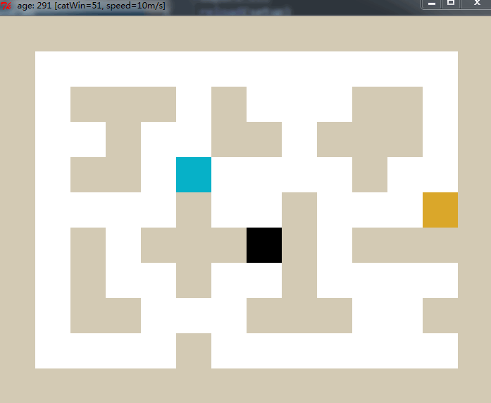
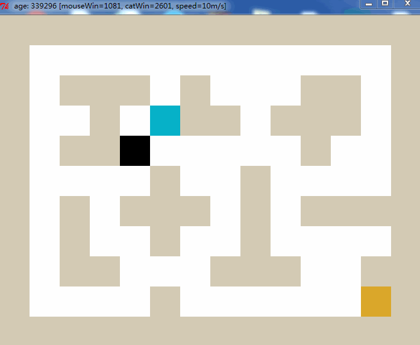

QLearningMouse
===================================================

<b>QLearningMouse</b>  is a small cat-mouse-cheese game based on [Q-Learning](https://en.wikipedia.org/wiki/Q-learning). The original version is by [vmayoral](https://github.com/vmayoral): [basic_reinforcement_learning:tutorial1](https://github.com/vmayoral/basic_reinforcement_learning/tree/master/tutorial1), I reconstructed his code to make the game more configurable, and what different most is that I use breadth-first-search([BFS](https://en.wikipedia.org/wiki/Breadth-first_search)) when cat chasing the AI mouse, so the cat looks much more brutal :P 

## About the game
Cat always chase the mouse in the shortest path, however the mouse first does not know the danger of being eaten. 
* <b>Mouse win</b> when eating the cheese and earns rewards value of 50, then a new cheese will be produced in a random grid.
* <b>cat win</b> when eating the mouse, the latter will gain rewards value of -100 when dead. Then it will relive in a random grid.

## Algorithm  
The basic algorithm of Q-Learning is:  
```
Q(s, a) += alpha * (reward(s,a) + gamma * max(Q(s', a') - Q(s,a))
```
    
```alpha``` is the learning rate.
```gamma``` is the value of the future reward.
It use the best next choice of utility in later state to update the former state. 

Learn more about Q-Learning:  
1. [The Markov Decision Problem : Value Iteration and Policy Iteration](http://ais.informatik.uni-freiburg.de/teaching/ss03/ams/DecisionProblems.pdf)  
2. [ARTIFICIAL INTELLIGENCE FOUNDATIONS OF COMPUTATIONAL AGENTS : 11.3.3 Q-learning](http://artint.info/html/ArtInt_265.html)


## Example
Below we present a *mouse player* after **300 generations** of reinforcement learning:  
* blue is for mouse.
* black is for cat.
* orange is for cheese.



After **339300 generations**:  




## Reproduce it yourself

```bash
git clone https://github.com/fancoo/QLearningMouse
cd QLearningMouse
python greedyMouse.py
```
